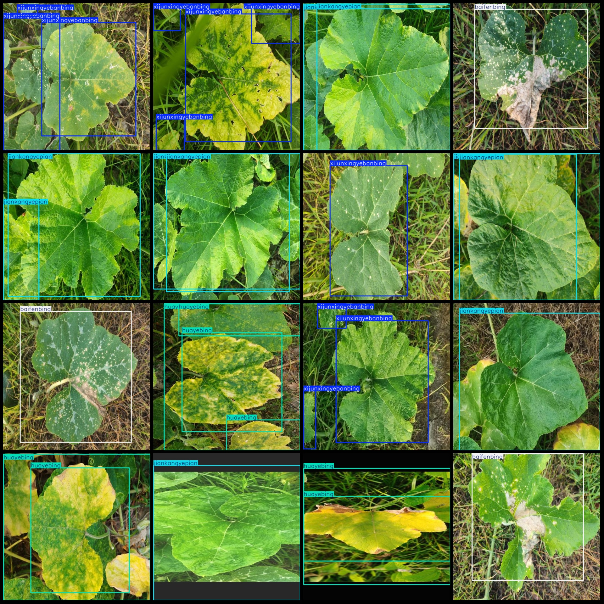
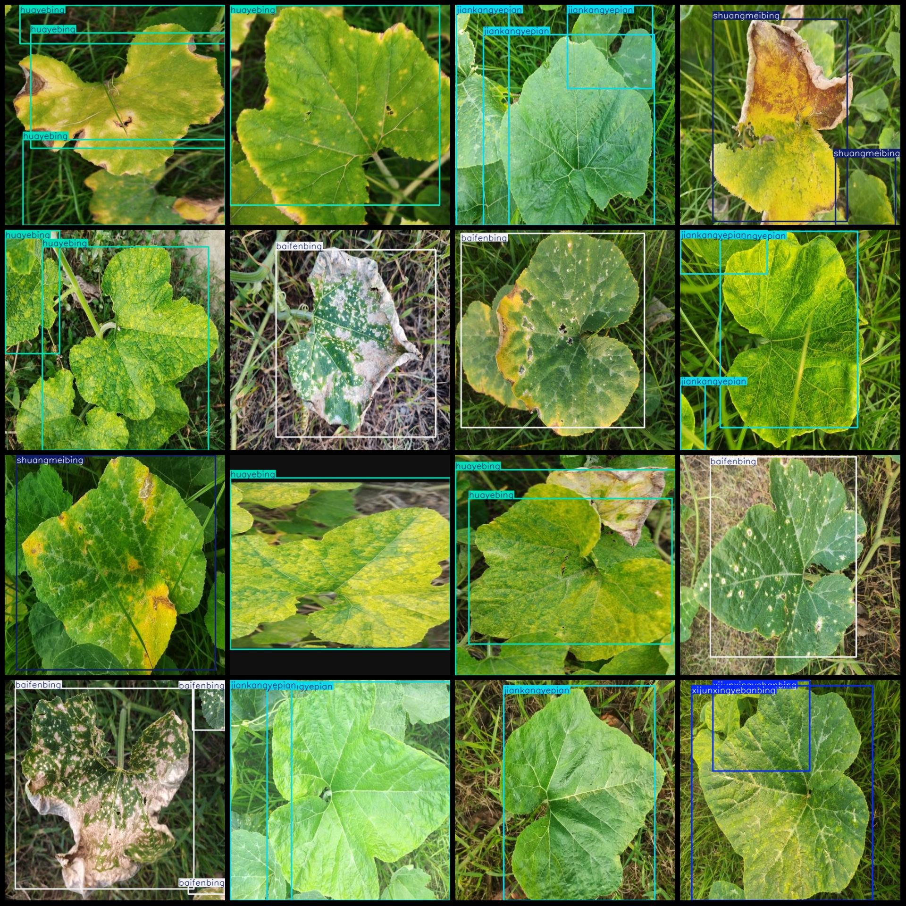

# Pumpkin Leaves Disease Detection Dataset in VOC+YOLO format with 1996 images and 5 categories

Based on the given dataset format and information, we can infer the following:

1. The dataset is organized as Pascal VOC format with additional YOLO format annotations.
2. There are 1996 images (jpg files) in total.
3. There are 1996 XML files containing annotations for each image.
4. There are 1996 text files containing annotations for each image, which correspond to the labels in the XML files.
5. There are 5 categories of annotations, which correspond to the listed categories in Chinese: ["White Powdery Mildew", "Pink and Leaves Disease", "Healthy Leaf", "Rainbow Mosaic Disease", "Bacterial Leaf Blight"].
6. The number of bounding boxes (boxes) for each category is as follows:
   - Baifenbing: 705 boxes
   - Huayebing: 721 boxes
   - Jiankangyepian: 772 boxes
   - Shuangmeibing: 630 boxes
   - Xijunxingyebanbing: 849 boxes
7. The total number of bounding boxes is 3677.
8. Each category occupies a different number of images based on their corresponding XML file counts.
baifenbing images = 398  
huayebing images = 400  
jiankangyepian images = 399  
shuangmeibing images = 389  
xijunxingyebanbing images = 410  
image resolution: 512x512  
Using annotation tool: labelImg
Annotation rule: Draw a rectangle around the class.
Important notes: The dataset does not have a split into training, validation, and test sets; you need to manually divide it.
Special statement: This dataset does not guarantee the accuracy of the trained model or weight file.
Image preview:
## Images

Here is a pay link on Stripe ( https://buy.stripe.com/3cs8yP7sY87d0vu9AB ). Please contact me lonlonago@foxmail.com after funding $89, and I will send you a complete data files , thank you!

